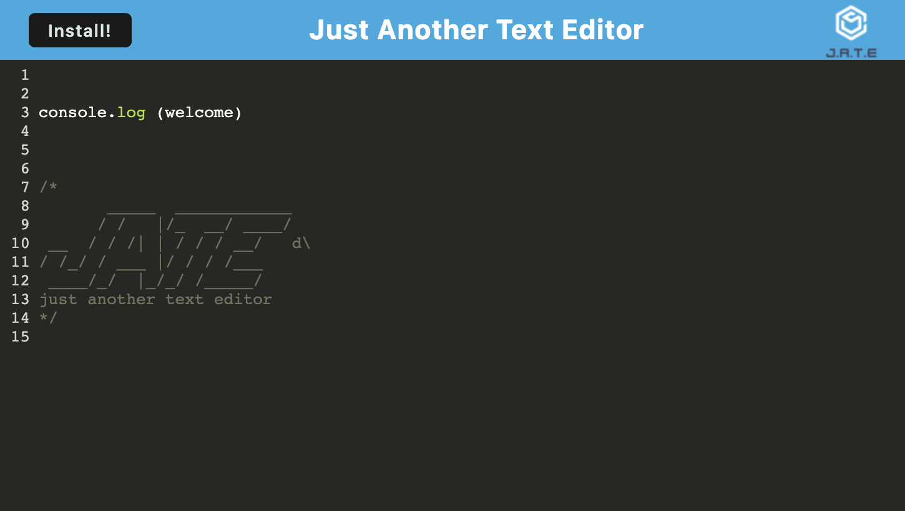

# Text-Editor

Just another text editor that meets the Progressive Web App (PWA) criteria. The application will also function offline.

## Table of Contents

- [Live link](#deployed-link)
- [Installation](#install)

---

## Deployed Link

---

## install

Make sure you have the Latest version of [node.js](https://nodejs.org/en/).

After you have cloned down this repository into your desktop run these following commands in your terminal.

```
npm install
```

```
npm run build
```

```
npm start
```

Then on your browser go to [http://localhost:3000/](http://localhost:3000/).



For offline use you can click on the install button or on your URL you'll find this icon


## Behind the Scenes !

Heres the service worker


Manifest in the works


---

## License

for UC Berkely Extention bootcamp program

The MIT License (MIT)

---

#### Author and App developer - Joshua Meza

[GitHub](https://github.com/705h-S) <br>
[linkedin](https://www.linkedin.com/in/joshua-meza-918b77224/)
